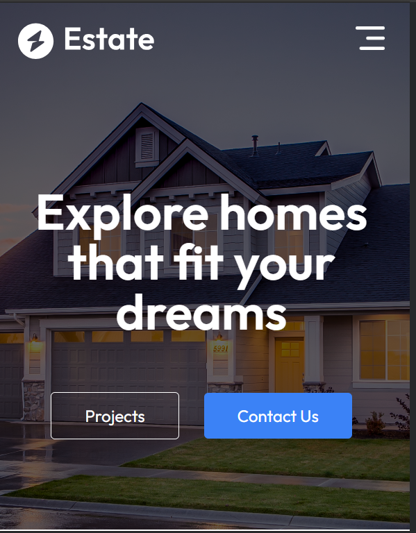
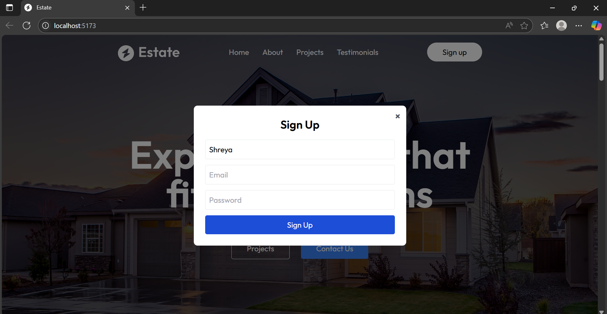
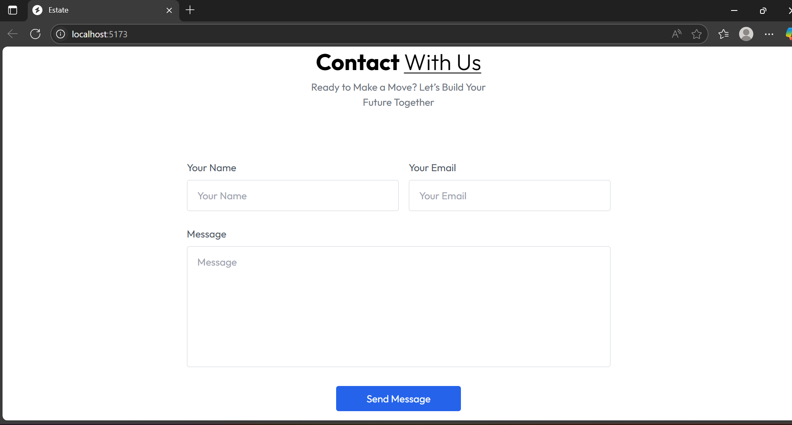

# 🏠 Real Estate Landing Page

A sleek and responsive real estate website built using **React.js**, **Tailwind CSS**, and **Vite**. This project replicates a modern real estate landing page, featuring smooth UI, mobile responsiveness, and interactive features like newsletter subscription and a modal-based Sign Up form.

## 🚀 Features

- 📱 Responsive design for all devices
- 💌 Newsletter subscription with input form
- 🔒 Sign-up modal with Name, Email, and Password
- 📖 Smooth scroll navigation and mobile menu
- 🎨 Styled using Tailwind CSS
- ⚡ Fast build with Vite

---

## 🖼️ Screenshots

### 🖥️ Desktop View


### 📱 Mobile Menu



### 🧾 Sign-Up Modal


### Contact-us


---

## 🛠️ Tech Stack

- React.js
- Tailwind CSS
- Vite
- JSX & Responsive Design

---

## 📂 Getting Started

To run this project locally:

```bash
git clone https://github.com/your-username/real-estate.git
cd real-estate
npm install
npm run dev
